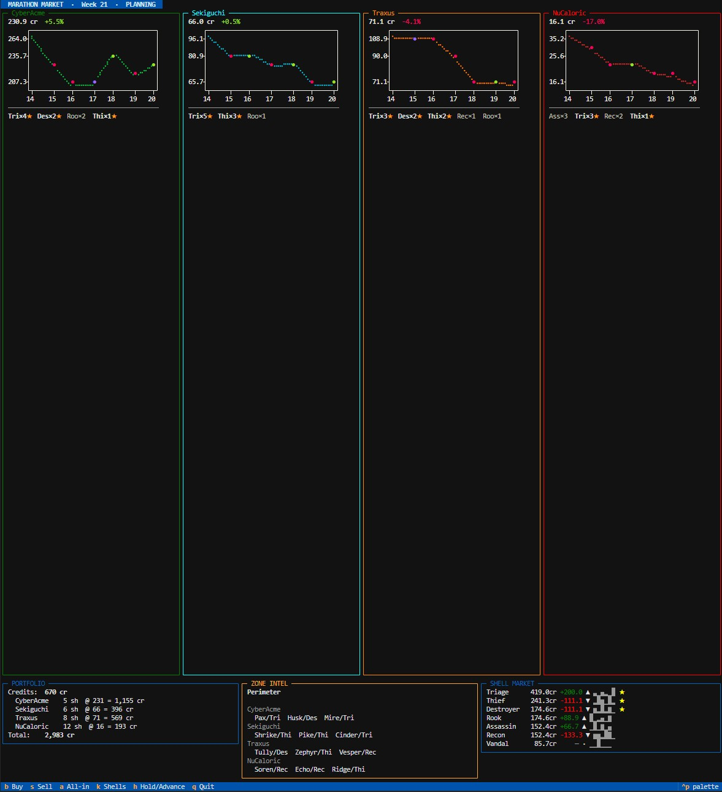

# Marathon Market Simulator

A terminal market simulation set in the Marathon universe. Players trade stocks in
runner companies — bio-synthetic operatives deployed across zones of varying difficulty.
Stock prices move on weekly runner performance across **all three zones**, but players can
only monitor one zone directly. The gap between what you can see and what moves the market
is where the game lives.

## Setup

Requires [uv](https://github.com/astral-sh/uv).

```bash
uv sync

# Textual TUI (default)
uv run python marathon_market.py

# Console fallback — plain text, debug-by-default (all hidden zones visible)
uv run python marathon_market.py --console
```

---

## How the system works

### Runners and shells

Each of the four companies maintains a **roster of 9 persistent runners**. Runners are
bio-synthetic consciousnesses inhabiting replaceable bodies called **shells**. A runner
carries three attributes — `combat`, `extraction`, `support` — that always sum to 1.0.

There are 7 shell types. Each shell has its own affinity profile across the three axes:

| Shell | Combat | Extraction | Support | Doctrine |
|-------|--------|------------|---------|----------|
| Destroyer | 0.70 | 0.20 | 0.10 | GREEDY |
| Assassin  | 0.60 | 0.30 | 0.10 | GREEDY |
| Vandal    | 0.50 | 0.40 | 0.10 | BALANCED |
| Thief     | 0.20 | 0.70 | 0.10 | CAUTIOUS |
| Recon     | 0.20 | 0.30 | 0.50 | CAUTIOUS |
| Triage    | 0.10 | 0.10 | 0.80 | SUPPORT |
| Rook      | 0.30 | 0.50 | 0.20 | BALANCED |

A runner's **effective capability** is a weighted blend of their own attributes and their
shell's affinities. Surviving weeks in a shell slowly **drifts** the runner's attributes
toward that shell's profile — specialization emerges from career experience over time.

### Zones and squads

Every week each company deploys all 9 runners as **three squads of 3**, one per zone:

| Zone | Difficulty | Loot pool | Visible to player? |
|------|------------|-----------|-------------------|
| Perimeter | Easy (0.1) | 12 items | Yes — your monitored zone |
| Dire Marsh | Medium (0.3) | 8 items | Hidden |
| Outpost | Hard (0.5) | 5 items | Hidden |

Inside a zone, squads compete for a **shared, finite loot pool** across up to 8 ticks.
Each tick they may find items, encounter other squads, fight, or choose to extract.
A squad's **doctrine** (GREEDY / CAUTIOUS / BALANCED / SUPPORT) governs when it decides
to leave — derived from the dominant shell type among its three runners.

If a squad is **eliminated in combat**, all three runners die and their loot is forfeit
(winners may steal Uncommon+ items). Dead runners are replaced by fresh recruits between
weeks.

### Stock prices

At the end of each week, a company's stock price moves based on how much credit its
runners extracted across **all three zones** compared to a calibrated baseline expectation.
A good week across the hidden zones can push a price up even if Perimeter looked quiet —
and vice versa.

```
delta      = total_credits_extracted − baseline
normalized = delta / expected_weekly_stddev
price_pct  = (normalized × 10) + random_noise(±2%)
```

### The shell economy

Shells are bought at recruitment with a starting allowance of **250 cr**. Shell prices
are not fixed — they scale with how widely each shell is currently adopted across all
rosters:

```
price[shell] = 200 × (1 + 4 × (adopted_share − 1/7))
```

A shell worn by more than its fair share (1/7 ≈ 14.3%) of runners costs more;
under-adopted shells get cheaper. This creates natural cost pressure: when Destroyer,
Thief, and Triage dominate (which they do early, since they're capability-optimal),
their prices rise until a fresh recruit with 250 cr can no longer afford them and falls
to cheaper middle shells. Equilibrium settles around 58% premium / 42% middle adoption.

### Information asymmetry

You see Perimeter. The market sees everything. This is the core tension:

- A company's squad could look fine in Perimeter while both hidden squads were wiped,
  sending its price down 15%.
- A company's Perimeter squad could be eliminated while its hidden squads cleaned out
  Outpost, sending its price up despite the visible bad news.
- The `[K]` shell market view is the one non-deceptive signal — it tells you which
  companies are fielding aggressive (GREEDY) vs. conservative (CAUTIOUS) doctrines
  based on shell adoption, before you know the results.

---

## Interface

### Textual TUI (default)

The primary interface is a persistent Textual TUI — no scrolling walls of text, all
information visible simultaneously.



```
┌ MARATHON MARKET  ·  Week 4  ·  PLANNING ─────────────────────────────────────────────┐
│ status bar                                                                            │
├─ CyberAcme ──────┬─ Sekiguchi ──────┬─ Traxus ─────────┬─ NuCaloric ───────────────┤
│ 461.0 cr  +21.4% │ 310.5 cr  -1.9%  │ 284.9 cr  -9.9%  │ 272.9 cr  +3.2%           │
│                  │                  │                  │                            │
│  (braille line   │  (braille line   │  (braille line   │  (braille line chart       │
│   chart of price │   chart, cyan)   │   chart, orange) │   red, last 7 weeks)       │
│   history, green)│                  │                  │                            │
│ ──────────────── │ ──────────────── │ ──────────────── │ ─────────────────────────  │
│ Des×3★ Thf×2★    │ Thi×3★ Tri×2★   │ Des×3★ Tri×2★   │ Tri×5★ Thi×2★ Des×1★      │
├──────────────────┴──────────┬───────┴──────────────────┴──────┬────────────────────┤
│ PORTFOLIO                   │ ZONE INTEL                      │ SHELL MARKET       │
│ Credits:  8,600 cr          │ Perimeter  [Easy]               │ Destroyer  219cr ▲ │
│ CyberAcme  5sh @ 461 = …    │ CyberAcme  [Yara/Thi …]        │ Thief      241cr ▼ │
│ Total:    10,905 cr         │ Sekiguchi  [Tessa/Thi …]       │ Triage     263cr · │
│                             │ …                               │ …                  │
└─────────────────────────────┴─────────────────────────────────┴────────────────────┘
  [B]uy  [S]ell  [A]ll-in  [K]shells  [H]old/Advance  [Q]uit
```

**Company panels** — one per company, border colour matches brand (CyberAcme green,
Sekiguchi cyan, Traxus orange, NuCaloric red). Each shows the current price, last week's
change, a braille line chart of the last 7 price points with expectation dots
(green=beat / yellow=met / red=missed), and a compact shell composition row.

**Portfolio** — credits, open positions, total value, and week-over-week gain/loss (shown
after results).

**Zone Intel** — planning phase shows a squad preview for the monitored zone (Perimeter);
results phase shows each company's Perimeter outcome (RETURNED / LOST, credits, kills).

**Shell Market** — live ticker for all 7 shells: current price, week-over-week delta
(coloured), trend arrow, and a 6-week sparkline. Updates every time a week resolves.

**Key bindings** (single keypress, always visible in the footer):

| Key | Action |
|-----|--------|
| `B` | Buy shares (modal) |
| `S` | Sell shares (modal) |
| `A` | All-in — spread available credits equally across all four companies |
| `K` | Shell market overlay — full price/adoption/sparkline table |
| `H` / `Enter` | Hold (planning) or advance to next planning phase (results) |
| `Q` | Quit |

### Console mode — `--console`

```bash
uv run python marathon_market.py --console
```

Plain-text fallback — useful for validating game logic without TUI overhead. Debug output
is **on by default** in console mode: after each week it prints all hidden zone outcomes,
the full shell market, and each company's shell composition breakdown.

### Shell market overlay — `K`

Press `K` during the planning phase to open the full shell market overlay.

```
  Shell          Price      Δ wk       Trend       Adoption
  ──────────  ────────  ────────  ─  ───────  ─────────────
  Triage        263.5cr     -44.4  ▼   ▁▆▆▁█▃   8 (22.2%) ★
  Thief         241.3cr     -22.2  ▼   ▁██▆▃▁   7 (19.4%) ★
  Destroyer     219.0cr       —    ·   █▇▇▇▁▁   6 (16.7%) ★
  Recon         196.8cr     +44.4  ▲   ▄▁▁▅▅█   5 (13.9%)
  Assassin      174.6cr       —    ·   ▁▁▁▁██   4 (11.1%)
  Rook          174.6cr     +22.2  ▲   █▅▅▅▁▅   4 (11.1%)
  Vandal        130.2cr       —    ·   █▁▁▁██   2 ( 5.6%)
```

**Sparkline** — last 6 weeks of price history (`▁` = low, `█` = high within that shell's range).
**Adoption** — runners currently wearing this shell out of 36 total. `★` = premium archetype.

High adoption + rising price means companies still value this shell despite the cost.
Low adoption + falling price means a cheap entry window for the next recruitment wave.

---

## Calibration

If you change zone count, roster size, item values, or any core sim parameters, re-derive
the pricing constants with a 1000-week headless run:

```bash
uv run python -c "
from runner_sim.market.calibration import headless_calibration
mean, stdev = headless_calibration(weeks=1000, seed=42)
print(f'BASE_EXPECTATION     = {mean/3:.2f}')
print(f'EXPECTED_DELTA_RANGE = {stdev:.2f}')
"
```

Paste the output into `runner_sim/market/pricing.py`.

---

## Scripts

### `marathon_market.py` — Main game

```bash
uv run python marathon_market.py [--debug]
uv run python marathon_market.py --console [--debug]
```

| Flag | Description |
|------|-------------|
| *(none)* | Launches the Textual TUI. |
| `--console` | Plain-text console mode. Debug output (hidden zones, shell breakdown) is on by default. |
| `--debug` | TUI only — reserved for future use; console mode ignores it (always debug). |
| `--trace-ai` | Print every behaviour-tree extraction/engagement decision to stdout. |

### `runner_sim` — Standalone runner harness

Isolated runner ecosystem simulation — useful for validating that veteran runners
outperform novices and that shell affinity drift works as expected, without the full
market loop.

```bash
uv run python -m runner_sim [--weeks N] [--pool N] [--seed N] [--quiet] [--print-history]
```

### `squad_analysis.py` — Squad composition win-rate analysis

Monte Carlo analysis of every possible 3-shell squad composition, ranked by win rate.

```bash
uv run python squad_analysis.py
```

---

## Documentation

Design notes live in [`docs/`](docs/):

| File | Contents |
|------|----------|
| [`runner_design.md`](docs/runner_design.md) | Runner attribute system, shell affinities, and the capability formula |
| [`runner_lifecycle.md`](docs/runner_lifecycle.md) | How runners die, how recruitment works, how squads are assigned to zones |
| [`future_design.md`](docs/future_design.md) | Planned features: adaptive company AI, player board membership, shell market deepening |
| [`zone_sim_walkthrough.md`](docs/zone_sim_walkthrough.md) | Tick-by-tick walkthrough of the zone simulation engine |
| [`outcomes_design.md`](docs/outcomes_design.md) | Per-runner outcome distribution: credit shares, kill attribution, drift |
| [`tuning_levers.md`](docs/tuning_levers.md) | Calibration constants and what to adjust when the market feels off |
| [`marathon_market_prototype_spec.md`](docs/marathon_market_prototype_spec.md) | Original prototype specification |
| [`combat_ideas.md`](docs/combat_ideas.md) | Future combat resolution improvements |
